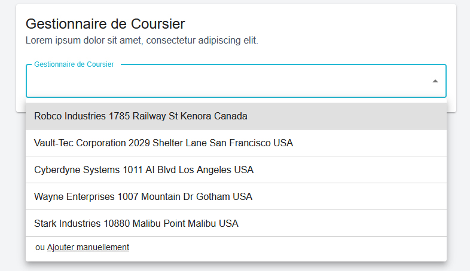
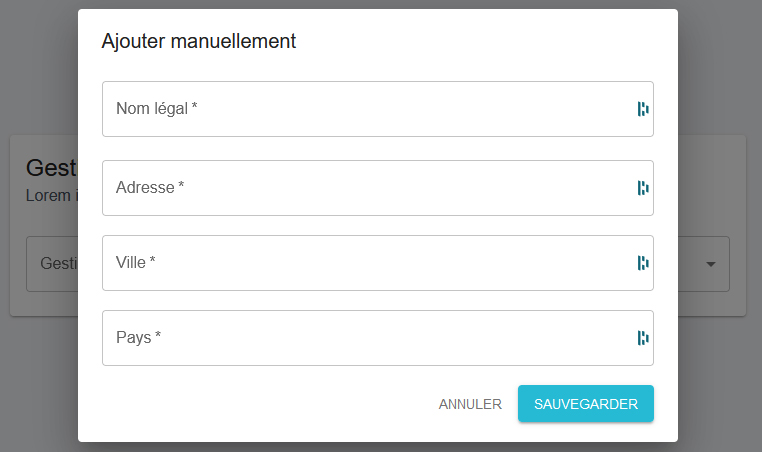
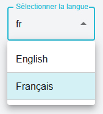

This is an exercice to realise a mockup in react, mui, nextjs, tailwind, typescript for Tinubu.

## Getting Started

Launch the development server:

```bash
yarn dev
```

Open [http://localhost:3000](http://localhost:3000) with your browser to see the result.





